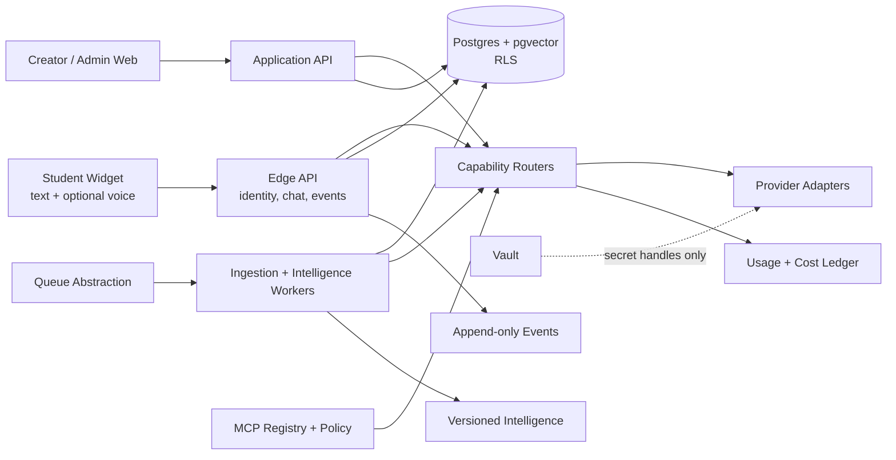

# System Architecture

## Principles

Locked: tenant isolation, provider-neutral business logic, evidence-backed intelligence, cost attribution, idempotent jobs, human curation for diagrams, optional voice with text fallback, and deny-by-default tools.



## Deployable boundaries

| Boundary | Owns | Must not own |
|---|---|---|
| Widget | host-safe UI, local state, capture, playback, telemetry batch | provider keys, opportunity scores, tool policy |
| Edge API | session identity, authorization, streaming orchestration, event validation | named-provider business rules |
| Web app | Creator/Admin workflows and server-side actions | direct Vault reads in browser |
| Workers | ingestion, embeddings, diagrams, clustering, memory, scoring, digests | unscoped tenant queries |
| Database | system of record, RLS, vectors, audit/cost/event facts | provider orchestration |
| Routers/adapters | capability selection and external integration | product policy |

## Request context

Every service operation receives an immutable context:

```ts
interface RequestContext {
  requestId: string;
  tenantId: string;
  actor: { type: "student" | "creator" | "owner" | "system"; id?: string; role?: string };
  sessionId?: string;
  conversationId?: string;
  fundingSource: "platform" | "tenant_byok";
  deadlineMs: number;
  traceId: string;
}
```

Tenant ID is resolved and authorized at the boundary, never accepted as trustworthy body data.

## Chat flow

1. Identify Tenant by public key; resolve Student identity tier; issue scoped token.
2. Validate request, rate limit and create request context.
3. Embed through `EmbeddingRouter`; retrieve same-tenant chunks; optionally rerank.
4. Assemble prompt from active config, memory and retrieved data with injection boundaries.
5. Stream through `LLMRouter`; persist messages, citations, telemetry and Events.
6. Emit only approved same-tenant assets through signed URLs.
7. On provider/retrieval failure, follow declared degradation: fallback provider, grounded limited response, or explicit retry state.

## Job contract

Jobs have `tenant_id`, type, schema version, idempotency key, payload reference, priority, attempt count, timestamps and trace ID. Workers claim with leases; retries are bounded with jitter; poison jobs enter a visible dead-letter state. Partial output is committed only at idempotent checkpoints.

## Environments

Local/test, staging and production use separate databases, Vaults, keys, public-key namespaces and storage. Production data is never copied to lower environments without approved de-identification. Infrastructure/provider choices behind interfaces may differ by environment.

## Degradation hierarchy

1. same provider/adapter retry for transient errors within deadline;
2. healthy compatible fallback allowed by Tenant policy;
3. reduced capability (no rerank, raster not SVG, text not voice, delayed digest);
4. explicit unavailable state with preserved draft/input and safe retry;
5. never cross Tenant, bypass consent, expose secrets, serve unapproved assets, or grant extra tools.
