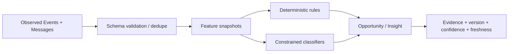

# Data and Intelligence

The v3 schema in [Product Specification §6](01-PRODUCT-SPECIFICATION.md#6-database-schema) is the baseline. Migrations MAY normalize or extend it, but must preserve its semantics.

## Canonical Event envelope

```ts
type EventType =
  | "widget_loaded" | "widget_opened" | "widget_closed" | "widget_expanded"
  | "widget_resized" | "widget_minimized" | "message_sent" | "response_streamed"
  | "response_rated" | "source_clicked" | "diagram_viewed" | "diagram_zoomed"
  | "conversation_resumed" | "page_view" | "session_start" | "session_end"
  | "module_progress" | "member_joined" | "low_confidence_answer" | "no_kb_coverage"
  | "voice_permission_requested" | "voice_permission_result" | "voice_session_started"
  | "voice_session_ended" | "voice_interrupted" | "voice_fallback_to_text"
  | "transcript_partial" | "transcript_final";

interface DomainEvent<T extends EventType = EventType, P = unknown> {
  eventId: string; schemaVersion: 1; type: T;
  tenantId: string; subjectUserId?: string; actorType: "student"|"creator"|"owner"|"system";
  conversationId?: string; sessionId?: string;
  occurredAt: string; ingestedAt: string;
  source: "widget"|"edge_api"|"dashboard"|"worker"|"webhook";
  identityTier?: "verified"|"self_reported"|"anonymous";
  consent: { analytics: boolean; voice?: boolean; recording?: boolean };
  payload: P; idempotencyKey?: string; traceId: string;
}
```

The taxonomy is closed and discriminated payload schemas are versioned in code. Unknown type/version is rejected or quarantined, never coerced.

## Additional required records

| Record | Required fields |
|---|---|
| `provider_configs` | tenant, capability, adapter, secret handle, policy, status |
| `provider_health` | adapter/capability/region, status, checked_at, latency/error window |
| `cost_ledger` | tenant, request/job, capability, provider/model, quantity/unit, estimated/final cost, currency, funding source, occurred_at |
| `opportunities` | tenant, student, offer, policy version, score/label, confidence, freshness, lifecycle, evidence refs |
| `consents` | tenant, subject/creator, purpose, scope, version, granted/revoked timestamps, evidence |
| `tool_invocations` | tenant, actor, server/tool/version, authorization decision, risk, input/output refs, status, cost, trace |
| `retention_policies` | tenant, data class, retention days, legal hold/configuration |

## Lineage



Raw facts are append-only. Corrections append a superseding record. Derived records name source IDs, rule/model versions, feature window and computation time.

## Defined metrics

- Confusion: `questions_attributed / active_students` per lesson and window.
- Content gap: 30-day question cluster with average retrieval confidence `< 0.55`.
- Stall: ≥3 active days in 14 days, then ≥14 inactive days, course <80% complete.
- Module velocity: lessons completed/week compared with same-tenant cohort median.
- Intent labels remain v3: `<30 browsing`, `30–70 engaged`, `>70 high_intent`; exact component weights are blocked by O-09.

When source integration is degraded, derived metrics are `unknown/partial`, not zero. UI exposes data-through time and identity coverage.

## Privacy lifecycle

Collect minimum data; encrypt in transit/at rest; authorize every read; configure retention by class. Student export includes profile, events, messages, derived insights and evidence. Deletion tombstones identity, removes personal content/vectors/assets and recomputes or de-identifies aggregates. Audit/legal records retain only permitted minimal metadata.
