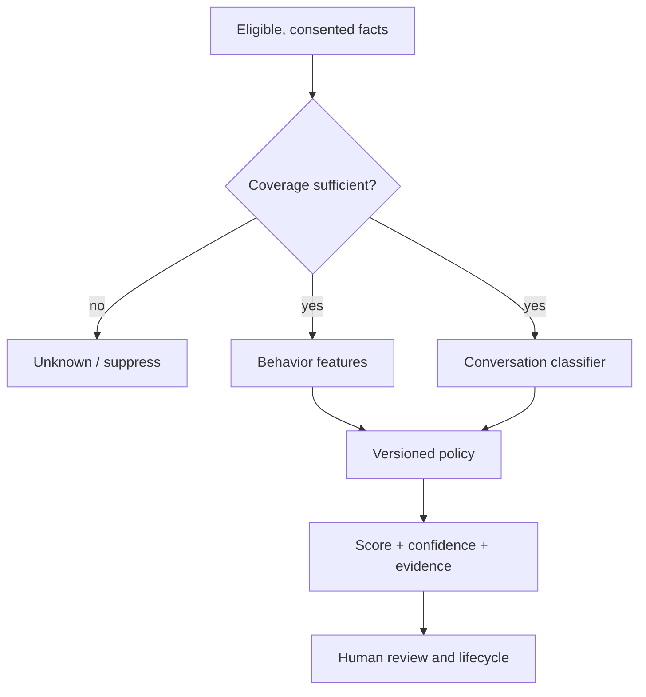

# Student Opportunity Engine

## Purpose and guardrails

The engine helps a Creator notice Students who may benefit from support or a relevant offer. It is advisory. It never contacts Students, changes access, sets pricing or makes consequential decisions.

## Opportunity contract

```ts
interface StudentOpportunity {
  id: string; tenantId: string; endUserId: string; offerId?: string;
  kind: "support_needed"|"offer_fit"|"high_intent"|"win"|"stall";
  score?: number; label: "watch"|"warm"|"hot"|"unknown";
  confidence: number; computedAt: string; evidenceThrough: string; expiresAt: string;
  policyVersion: string; identityTier: "verified"|"self_reported";
  evidence: Array<{ kind:"message"|"event"|"metric"; refId:string; excerpt?:string; fact:string }>;
  limitations: string[];
  status: "new"|"seen"|"actioned"|"dismissed"|"converted"|"expired";
}
```

Anonymous Students never receive individual opportunities. Self-reported identity is visibly flagged. Sensitive inferences unrelated to learning/offer fit are prohibited.

## Scoring pipeline



Locked inputs from v3: recency, frequency, session depth, expansion rate, return visits, velocity vs cohort, question depth, buying language, wins, stalls and progress. Locked label thresholds for v3 intent score are `<30`, `30–70`, `>70`. **Component weights, minimum data, opportunity thresholds, expiry and offer matching remain O-09 and must not be invented.**

The classifier returns strict JSON:

```ts
interface ConversationClassification {
  questionDepth: "surface"|"applying"|"implementing";
  buyingLanguage: boolean; buyingEvidenceMessageIds: string[];
  winDetected: boolean; winEvidenceMessageId?: string;
  confidence: number; model: string; promptVersion: string;
}
```

Classifier claims without valid same-tenant evidence references are discarded.

## Creator workflow

The Hot Student card shows label, relevant offer/support context, the 2–4 strongest evidence facts, confidence, identity tier and freshness. Detail shows timeline, conversation excerpts, progress comparison, limitations and lifecycle actions. “Recommended next step” is editable guidance, never a send button unless a later separately authorized communications feature exists.

Feedback (`dismissed_false_positive`, `wrong_offer`, `helpful`) is stored separately from observed behavior and used only after an approved policy change.

## Safety and QA

- Suppress on revoked analytics consent, anonymous identity, stale evidence, insufficient source coverage or tenant degradation.
- Do not infer protected/sensitive traits.
- Quote only minimum necessary excerpts and honor role permissions.
- Backtest per tenant; report precision at review capacity, false-positive rate, coverage and calibration.
- Test identical fixtures deterministically per policy version.
- Require owner approval and migration note for any threshold/weight change.
