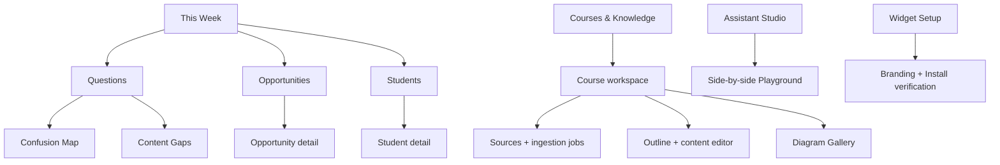

# UX Information Architecture

## Role surfaces

| Role | Primary outcome | Navigation |
|---|---|---|
| Student | Get grounded help without leaving learning context | Widget conversation only |
| Creator/Teacher viewer | Understand Students/content | This Week, Questions, Students, Opportunities, Courses & Knowledge |
| Creator/Teacher admin | Understand + configure | Viewer routes plus course editing/ingestion, Assistant Studio, Widget Setup, Settings |
| Platform Owner | Operate all tenants | Tenants, Onboarding, Ingestion, Providers, Usage & Margin, Health, Audit |

Role and tenant policy determine visibility server-side; hidden navigation is not authorization.

Tenant context is persistent and unmistakable on every Creator/Admin route. Cross-tenant switching is an explicit audited action; no search, recent item, deep link or browser restore may carry data from the prior tenant.

## Creator sitemap

Cross-links preserve filters and return context: insight → evidence → Student/lesson/conversation; content gap → representative questions → KB coverage; opportunity → Student timeline.

## Core flows

- Student: load → identify/degrade → type/speak/attach in one composer → scan/extract if attached → stream → source/diagram → continue in any modality → rate → resume.
- Creator weekly review: This Week → inspect insight → verify evidence/freshness → action/dismiss → return with state preserved.
- Creator course quick path: create course → drag/drop or connect sources → automatic classification/extraction → review warnings/diff → preview → publish atomic version.
- Creator edit/recovery path: find lesson/source → edit or clean → choose affected scope → preview retrieval/diagram impact → selectively reprocess → publish or roll back.
- Studio: edit draft → compare active/draft in Playground → validate → publish → audit → rollback.
- Admin onboarding: tenant → plan/identity mode → source ingest → key/webhook → Voice Guide → diagrams → mappings → brand → QA → install verification → live.

The web UI, management MCP and API expose the same domain vocabulary and job states so a person can start work in one surface and safely inspect or continue it in another.

## Universal screen contract

Every required screen documents and prototypes:

| State/behavior | Requirement |
|---|---|
| Empty | Explain why, value, and one safe next action |
| Loading | Layout-stable skeleton/progress; preserve prior usable data where safe |
| Populated | Plain-language answer first, evidence and drill-down |
| Error | Scope, retry, preserved work and support reference |
| Degraded integration | Missing capability/data, last success, effect and fix |
| Permission limited | Explain limitation without leaking inaccessible data |
| Responsive | Mobile/tablet/desktop reflow; no hover-only action |
| Keyboard | Logical focus, visible focus, shortcuts disclosed, Escape behavior |
| Animation | 120–240ms purposeful motion; reduced-motion alternative |
| Success | Confirm outcome and reversibility |
| Failure recovery | Retry/idempotency/draft preservation |
