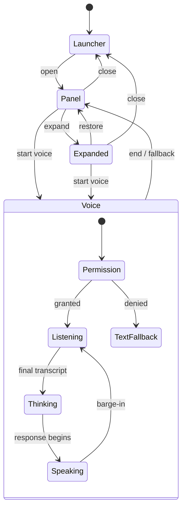

# Widget Experience

v3 widget requirements remain locked: vanilla TypeScript, Shadow DOM, <50KB gzipped, fail-silent, progressive sanitized markdown, approved assets only, tenant theming and three desktop states plus mobile sheet.

## State model

Mobile <768px uses a full-screen bottom sheet, safe-area insets and no drag resize. Conversation/modality state persists during presentation changes.

## Interaction contract

- Launcher announces assistant name/unread state; Enter/Space opens.
- Composer supports multiline text, send, stop generation, push-to-talk and tap-to-start if enabled.
- Streaming exposes cancel, retry and accessible live-region behavior without reading every token.
- Sources open safely; diagrams have caption, zoom, keyboard close and raster fallback.
- Voice shows mic/playback/recording privacy state, partial captions, mute and end controls.
- Escape closes transient overlays first, then collapses; focus returns to launcher.

## Failure behavior

Host incompatibility hides the widget and reports sanitized health telemetry. API/provider interruption preserves input and conversation, offers retry and text fallback. Permission denial never loops prompts. Offline shows reconnect state. Rate/budget limits explain when service returns. Degraded identity is functional and not presented as verified.

## Required mockups

Launcher, panel, expanded, mobile sheet, text streaming, voice permission/listening/thinking/speaking, source/diagram lightbox and all universal states from [UX IA](07-UX-INFORMATION-ARCHITECTURE.md#universal-screen-contract).
