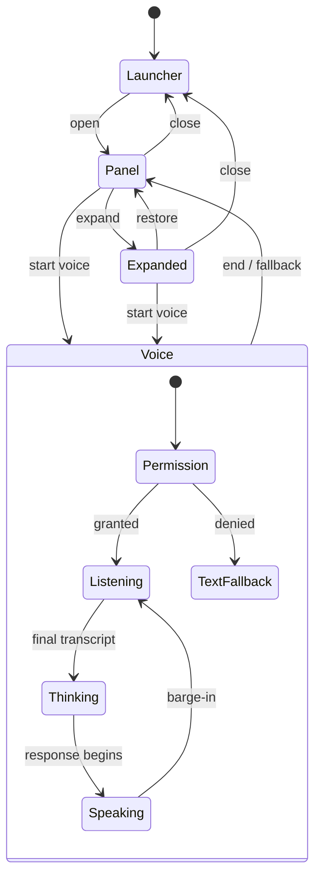

# Widget Experience

v3 widget requirements remain locked: vanilla TypeScript, Shadow DOM, <50KB gzipped, fail-silent, progressive sanitized markdown, approved assets only, tenant theming and three desktop states plus mobile sheet.

## State model

Mobile <768px uses a full-screen bottom sheet, safe-area insets and no drag resize. Conversation/modality state persists during presentation changes.

## Interaction contract

- Launcher announces assistant name/unread state; Enter/Space opens.
- Published Tenant branding supplies logo/avatar, assistant name, semantic
  colors, typography, welcome copy, voice and launcher style at runtime. The
  bundle contains only accessible fallback tokens.
- Desktop panel supports pointer and keyboard dragging plus bounded resize;
  expanded mode remains reversible. Persist size/position per Tenant and device,
  clamp it after viewport changes, and never allow the companion to become
  unreachable.
- A single composer supports multiline text, send, stop generation, file attach/drop/paste, push-to-talk and tap-to-start if enabled. Voice is a mode of the conversation, not a separate screen or session.
- A Student may attach supported files before or during a voice session. Attachment chips remain visible with filename, type, size, upload/scan/extraction state, remove/retry action and accessible error text.
- The same ordered thread renders typed messages, live/final transcripts, assistant text, spoken playback, attachments, sources and diagrams. Switching modality preserves the pending draft and turn context.
- Streaming exposes cancel, retry and accessible live-region behavior without reading every token.
- Sources open safely; diagrams have caption, zoom, keyboard close and raster fallback.
- Voice shows mic/playback/recording privacy state, partial captions, mute and end controls.
- Tap-to-start voice is realtime: listening, partial captions, turn detection,
  streaming assistant text/audio and barge-in occur within one live session.
  Voice-note upload alone does not satisfy voice mode.
- “Currently learning” is rendered from `ResolvedLearningContext`, derived in
  priority order from verified host context, URL mapping and progress resume.
  Unknown or low-confidence context is labeled honestly instead of guessed.
- Escape closes transient overlays first, then collapses; focus returns to launcher.

## Failure behavior

Host incompatibility hides the widget and reports sanitized health telemetry. API/provider interruption preserves input and conversation, offers retry and text fallback. Permission denial never loops prompts. Offline shows reconnect state. Rate/budget limits explain when service returns. Degraded identity is functional and not presented as verified.

Uploads are tenant- and conversation-scoped, use signed transport, and remain unavailable to retrieval until type/size validation, malware scanning and extraction succeed. Unsupported, encrypted, oversized, malicious or failed files show a localizable recovery path. The UI never implies that a chat attachment changed the course knowledge base; promotion is a separate authorized Creator workflow.

## Required mockups

Launcher, panel, expanded, mobile sheet, unified composer, attachment upload/scan/extract/failure, text streaming, modality switching, voice permission/listening/thinking/speaking, source/diagram lightbox and all universal states from [UX IA](07-UX-INFORMATION-ARCHITECTURE.md#universal-screen-contract).
