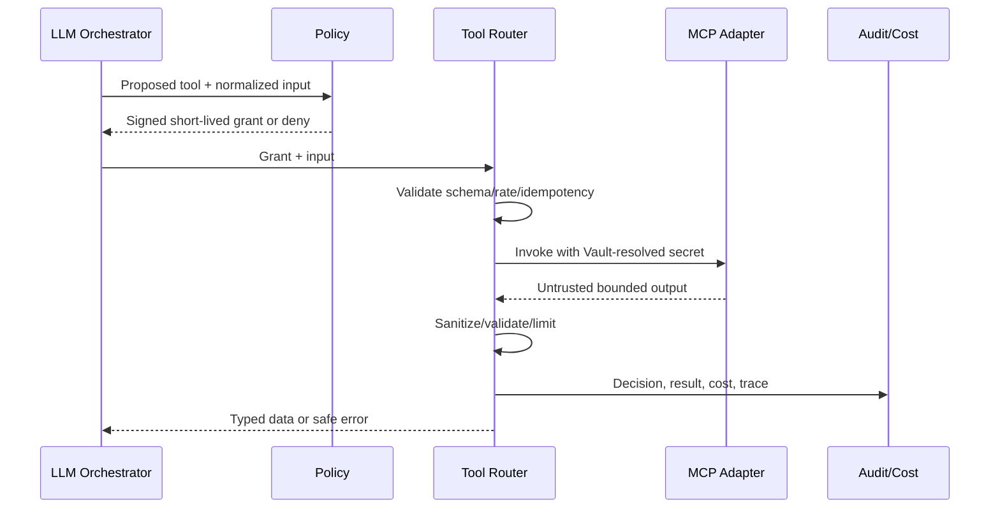

# MCP and Tools Architecture

## Trust model

MCP servers, tool descriptions, inputs and outputs are untrusted integration data. The registry discovers; policy authorizes. The model can propose only from a precomputed allowed capability set and never grants itself access.



## Registry and policy

```ts
type ToolRisk = "read_low"|"read_sensitive"|"write_reversible"|"write_high";
interface RegisteredTool {
  serverId:string; toolName:string; version:string; inputSchema:unknown; outputSchema?:unknown;
  permissions:string[]; risk:ToolRisk; capabilities:string[];
  timeoutMs:number; maxOutputBytes:number; adapterId:string;
}
interface ToolGrant {
  grantId:string; tenantId:string; actorId:string; role:string;
  serverId:string; toolName:string; toolVersion:string;
  permissions:string[]; expiresAt:string; inputHash:string; policyVersion:string;
}
```

Servers are centrally registered with transport, health, secret handles and ownership. Tenant enablement references registry entries and narrows permissions/rate/cost. Students have an empty grant set by default. Creator tools require explicit tenant enablement and role permission. High-risk writes require a separately designed confirmation workflow; no such tools are assumed enabled.

Registry entries cover MCP servers, provider adapters and agent runtimes behind capability contracts. Adding one does not change course, chat, ingestion or UI domain logic. An agent receives only explicit task-scoped capabilities, tenant context, budget and expiry; “agent” is never an authorization role by itself.

## Platform management MCP

The product publishes a first-party management MCP server for authorized people and agents. It is a supported control surface over the same application-service layer used by the Creator/Admin UI, never direct database or Vault access.

Initial resource/tool families:

| Family | Read resources/tools | Mutating tools |
|---|---|---|
| Tenants and courses | tenant/course summaries, permissions, active/draft versions | create/update course shell, copy approved template |
| Sources and content | outline, lesson/source metadata, extraction preview, version diff | upload-source intent, edit/clean content, replace/remove source |
| Ingestion | job/stage status, warnings, failed items, cost estimate | validate, start, cancel, retry failed stage, selectively re-ingest |
| Curation | chunk/retrieval preview, diagram candidates, QA results | approve/reject/edit diagram, accept placement/cleanup |
| Assistant | active/draft configuration, preview result | update draft, validate, publish, roll back |
| Operations | provider capability health, budgets, audit references | no secret readback; scoped configuration writes only when separately granted |

Large files use a short-lived tenant-bound upload intent; they are not embedded in tool arguments. Long operations return `{jobId, status, statusResource, traceId}` and can be polled or observed through a bounded subscription. Every mutating tool declares risk, supports an idempotency key, offers `dryRun` when meaningful, returns the affected version, and requires an explicit target. High-risk publish/delete/bulk operations use confirmation grants.

Prompts and resources explain the domain, but never contain secrets or bypass policies. Structured errors distinguish validation, permission, conflict, budget, provider degradation and retryable job failure so agents can recover without guessing.

## Invocation controls

Authorize Tenant/actor/role/tool/version/permissions; bind grant to normalized input; validate schema; rate/cost limit; enforce deadline and output size; resolve secrets from Vault; isolate network egress where possible; treat output as quoted data; scan/redact; log decision and result; store large payloads by protected reference.

Retries are allowed only when the tool declares idempotency and an idempotency key is present. Remote failure returns bounded typed error and does not widen permissions or substitute an unapproved server.

## Audit

Record request/trace, Tenant, actor/role, server/tool/version, risk, policy decision/reason, redacted input hash/reference, output reference/hash, start/end, status, retry, cost and provider metadata. Never log secrets or unnecessary personal data.

## Acceptance

Cross-tenant, unregistered, disabled, role-forbidden, expired-grant, schema-invalid, over-rate and over-budget invocations are denied before remote call. Prompt injection in tool output cannot trigger another tool. Timeout/output overflow cancels safely. Adding an adapter/registry entry requires no core chat change. Equivalent UI and MCP actions create the same domain result, version/job state, policy decision and audit evidence.
