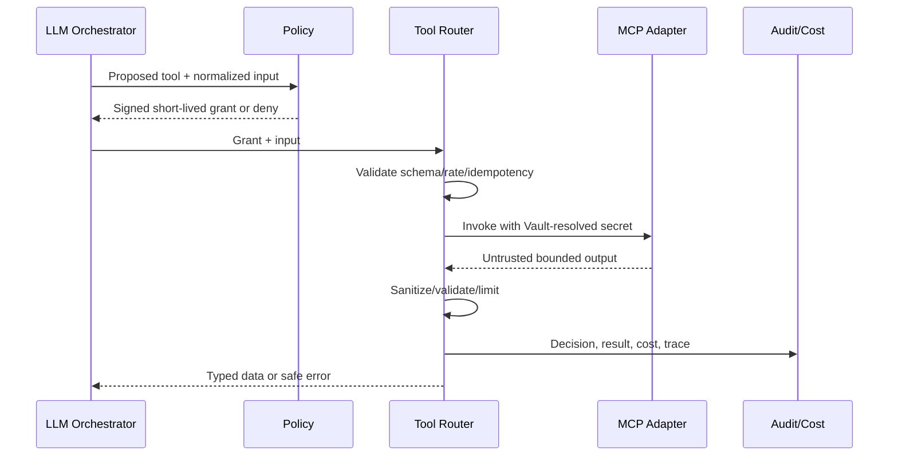

# MCP and Tools Architecture

## Trust model

MCP servers, tool descriptions, inputs and outputs are untrusted integration data. The registry discovers; policy authorizes. The model can propose only from a precomputed allowed capability set and never grants itself access.



## Registry and policy

```ts
type ToolRisk = "read_low"|"read_sensitive"|"write_reversible"|"write_high";
interface RegisteredTool {
  serverId:string; toolName:string; version:string; inputSchema:unknown; outputSchema?:unknown;
  permissions:string[]; risk:ToolRisk; capabilities:string[];
  timeoutMs:number; maxOutputBytes:number; adapterId:string;
}
interface ToolGrant {
  grantId:string; tenantId:string; actorId:string; role:string;
  serverId:string; toolName:string; toolVersion:string;
  permissions:string[]; expiresAt:string; inputHash:string; policyVersion:string;
}
```

Servers are centrally registered with transport, health, secret handles and ownership. Tenant enablement references registry entries and narrows permissions/rate/cost. Students have an empty grant set by default. Creator tools require explicit tenant enablement and role permission. High-risk writes require a separately designed confirmation workflow; no such tools are assumed enabled.

## Invocation controls

Authorize Tenant/actor/role/tool/version/permissions; bind grant to normalized input; validate schema; rate/cost limit; enforce deadline and output size; resolve secrets from Vault; isolate network egress where possible; treat output as quoted data; scan/redact; log decision and result; store large payloads by protected reference.

Retries are allowed only when the tool declares idempotency and an idempotency key is present. Remote failure returns bounded typed error and does not widen permissions or substitute an unapproved server.

## Audit

Record request/trace, Tenant, actor/role, server/tool/version, risk, policy decision/reason, redacted input hash/reference, output reference/hash, start/end, status, retry, cost and provider metadata. Never log secrets or unnecessary personal data.

## Acceptance

Cross-tenant, unregistered, disabled, role-forbidden, expired-grant, schema-invalid, over-rate and over-budget invocations are denied before remote call. Prompt injection in tool output cannot trigger another tool. Timeout/output overflow cancels safely. Adding an adapter/registry entry requires no core chat change.
