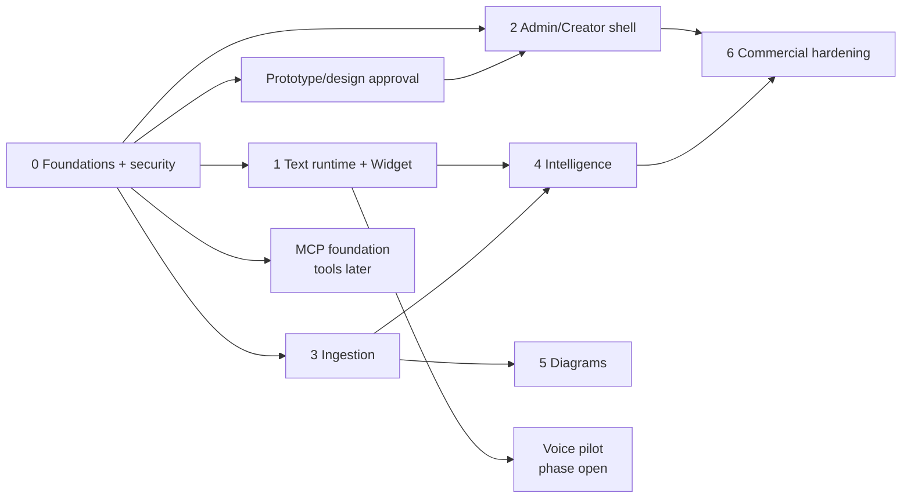

# Implementation Plan

This plan refines v3 phases without authorizing application implementation. Phase completion requires [Acceptance Tests](18-ACCEPTANCE-TESTS.md), not code presence.

## Phase 0 — foundations and migration

Schema/migrations/RLS, isolation harness, auth/roles, Vault, audit, Event validator, cost ledger, provider contracts/fakes/conformance, queue decision spike, CI/CD, design tokens and legacy migration plan. Do not copy `.env`, recordings or raw private assets.

Gate: all tenant negative tests pass; every fake provider operation produces telemetry; v3 source is traceable; migration inventory/hash plan approved.

## Prototype gate — before dashboard completion

Produce and approve all 12 addendum mockup groups with every state/behavior matrix. Validate Student and Creator task flows, keyboard, responsive and accessible theme behavior.

## Phase 1 — text runtime and Widget

Identify/chat SSE/events/rating/assets, retrieval/router integration, Widget states/mobile/resume/host safety, Circle staged identity and install test.

Gate: all v3 Phase 1 criteria plus provider failure/degradation, budget limit, XSS and accessibility acceptance.

## Phase 2 — Creator/Admin shell

Role-gated app, onboarding, tenant/key/provider controls, usage/margin, audit, This Week shell, KB, Studio/Playground and Widget Setup. Corresponding approved mockups are mandatory.

## Phase 3 — ingestion

Upload then Circle/playlist/URL connectors, idempotent workers, exact legacy chunking port, embeddings, auto Voice Guide, context mapping and loud operations UI.

## Phase 4 — intelligence

Events/features, clustering, confusion/content gaps, memory, webhooks, Student/Opportunity views and digest. Production Opportunity scoring is blocked until O-09 is approved.

## Phase 5 — diagrams

Candidate extraction, analysis, SVG/raster creation, secure storage, curation and Widget retrieval. No unapproved asset may be served.

## Optional voice pilot

After approved prototype, browser/support and policy decisions: non-recording session first, provider adapters, push/tap/barge-in/captions/text fallback, cost/privacy acceptance. Cloning/recording remain blocked without consent/retention approval.

## MCP/tools

Registry, deny-by-default policy, fake adapter and security tests may proceed in foundations. No real Creator tool is enabled until O-12 defines server, purpose, risk and permission. Student grants remain empty.

## Phase 6 — commercial hardening

Billing/plans, reconciliation, custom identity/domain, retention/export/delete UI, SLO/runbooks, production restore/incident evidence and additional connectors/adapters.

Every phase records migration/rollback, feature flag, telemetry, security review, cost impact and updated docs.
