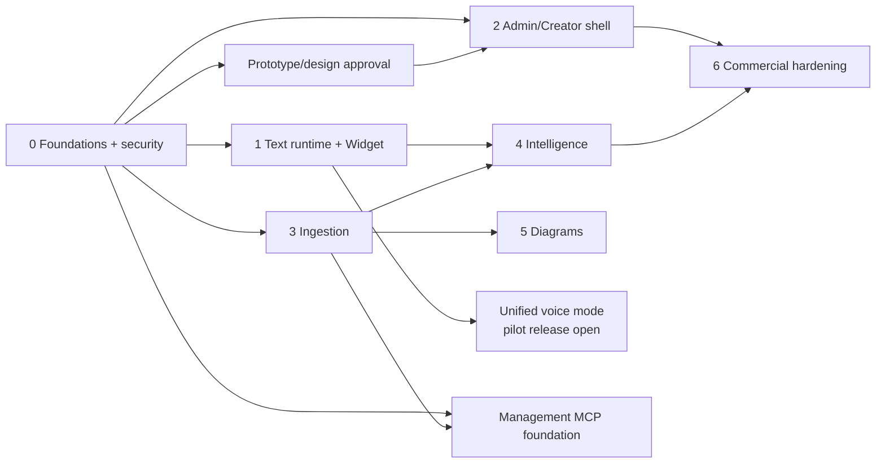

# Implementation Plan

This plan turns the v3 phases into an executable delivery sequence. Phase completion requires [Acceptance Tests](18-ACCEPTANCE-TESTS.md), not code presence alone.

## Phase 0 — foundations and migration

Schema/migrations/RLS, isolation harness, auth/roles, Vault, audit, Event validator, cost ledger, provider contracts/fakes/conformance, queue decision spike, CI/CD, design tokens and legacy migration plan. Do not copy `.env`, recordings or raw private assets.

Gate: all tenant negative tests pass; every fake provider operation produces telemetry; v3 source is traceable; migration inventory/hash plan approved.

## Prototype gate — before dashboard completion

Produce and approve all 12 addendum mockup groups with every state/behavior matrix. Validate Student and Creator task flows, keyboard, responsive and accessible theme behavior.

## Phase 1 — unified conversation runtime and Widget

Identify/chat SSE/events/rating/assets, retrieval/router integration, one text/voice/file composer, tenant-scoped attachment upload/scan/extraction, Widget states/mobile/resume/host safety, Circle staged identity and install test. Text ships as the baseline path; voice remains the same conversation contract even if its provider pilot is gated later.

Gate: all v3 Phase 1 criteria plus attachment isolation/quarantine, modality continuity, provider failure/degradation, budget limit, XSS and accessibility acceptance.

## Phase 2 — Creator/Admin shell

Role-gated app, persistent tenant context, onboarding, tenant/key/provider controls, usage/margin, audit, This Week shell, Courses & Knowledge workspace, Studio/Playground and Widget Setup. Corresponding approved mockups are mandatory.

## Phase 3 — ingestion

Upload then Circle/playlist/URL connectors, idempotent staged workers, exact legacy chunking port, embeddings, auto Voice Guide, context mapping and loud operations UI. Include rich-text/source editing, cleanup recipes, structure correction, draft/active versions, diff/impact preview, selective reprocessing and rollback. UI, API and MCP share job identifiers and stage semantics.

## Phase 4 — intelligence

Events/features, clustering, confusion/content gaps, memory, webhooks, Student/Opportunity views and digest. Production Opportunity scoring is blocked until O-09 is approved.

## Phase 5 — diagrams

Candidate extraction, analysis, SVG/raster creation, secure storage, curation and Widget retrieval. No unapproved asset may be served.

## Unified voice pilot

After approved prototype, browser/support and policy decisions: enable non-recording voice inside the existing conversation composer, with provider adapters, push/tap/barge-in/captions/attachment continuity/text fallback and cost/privacy acceptance. Cloning/recording remain blocked without consent/retention approval. Voice never forks a second student history.

## MCP/tools

Registry, first-party management MCP, deny-by-default policy, fake adapter and security tests proceed with foundations. Course/source/job read tools land before mutating tools; create/edit/clean/re-ingest/draft operations follow once the shared application services exist. No third-party Creator tool is enabled until O-12 defines server, purpose, risk and permission. Student grants remain empty.

## Phase 6 — commercial hardening

Billing/plans, reconciliation, custom identity/domain, retention/export/delete UI, SLO/runbooks, production restore/incident evidence and additional connectors/adapters.

Every phase records migration/rollback, feature flag, telemetry, security review, cost impact and updated docs.

## Calendar estimate

This is a planning range, not a delivery guarantee. It assumes three experienced full-time implementation lanes, prompt product decisions, access to required provider/staging accounts, and no migration of unknown legacy production data.

| Target | Elapsed time | Included evidence |
|---|---:|---|
| Approved interactive prototype and shared contracts | 2–3 weeks | Unified chat/voice/file flow, course operations, Creator/Teacher and Admin flows, tenancy/provider/MCP contracts |
| Internal end-to-end vertical slice | 5–7 weeks | One tenant/course from upload to grounded text chat, basic course edit/re-ingest, management MCP reads/jobs, audit/cost traces |
| Private pilot | 9–12 weeks | Multi-tenant onboarding, unified voice pilot, file uploads, Creator/Admin course operations, diagrams, initial intelligence and MCP mutations |
| Enterprise beta | 14–18 weeks | Isolation/security/accessibility/load evidence, restore/runbooks, provider fallback, cost controls, retention/export/delete, pilot remediation |

The critical path is tenant/security foundations → versioned ingestion and application services → unified runtime and course operations → production hardening. Diagrams, intelligence, provider adapters and UI polish can overlap after their input contracts stabilize. Extra agents do not compress the database/security and integration gates; adding focused engineering capacity mainly improves adapter, UI-state, QA and connector throughput.
